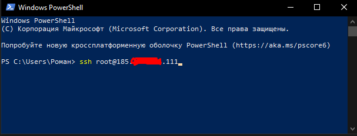
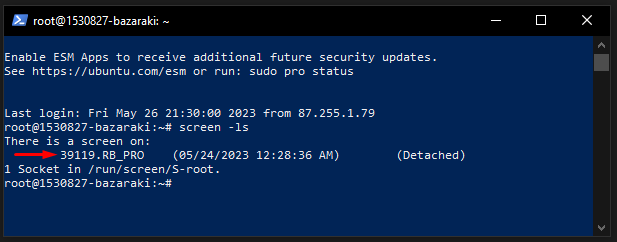
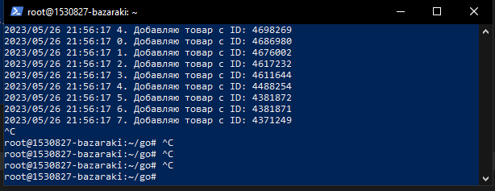

# Администрирование программы

Программа запущена на vps-сервере с помощьтю утилиты screen. Для подключения к процессу необходимо:

###### 1. Подключиться к vps серверу



###### 2. Узнать ID процесса утилиты screen

```bash
screen -ls
```



###### 3. Подключиться к процессу screen

```
screen -r 39119
```



Именно в этом процессе работает программа. Чтобы выйти из потока, нажмите `Ctrl+a` далее `d`.

##### Чтобы удалить поток, вопользуйтесь командой:

```bash
screen -S 39119 -X quit
```

##### Для создания нового потока воспользуйтесь командой:

```bash
screen -S bazaraki
```

##### Для запуска программы воспользуйтесь командой:

```bash
./main [Путь к файлу настройки БД] [Путь к файлу, содержащий токен Telegram] [Чат ID Telegram]
```
