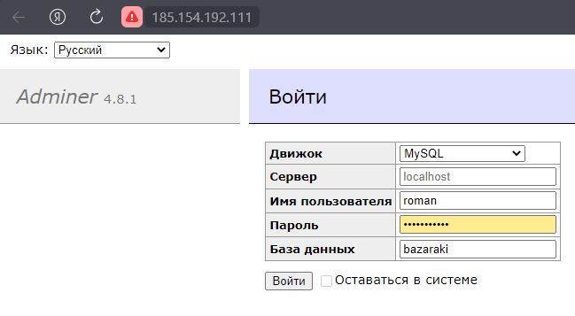
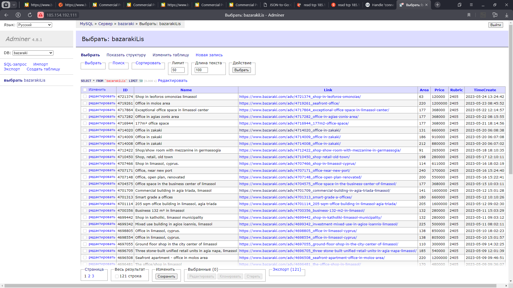

# Инструкция для менеджера

Для перехода в админ-панель, [перейдите по ссылке](http://185.154.192.111/adminer/?username=roman&db=bazaraki&select=bazarakiLis) и введите пароль

Вы попадёте в таблицу

### Что означает каждая строка?

* ID - у каждого объявления есть свой ID, в этой графе записан именно он;
* Name - Название объявления;
* Link - Ссылка на объявление;
* Area - Прощадь в квадратных метрах;
* Price - Цена в евро;
* Rubric - Категория данного объявления. 2405 - аренда, 2408 - продажа;
* TimeCreate - Дата и время создания объявления;

`Пожалуйста. Не удаляйте поля вручную, программа сама всё удалит.`
